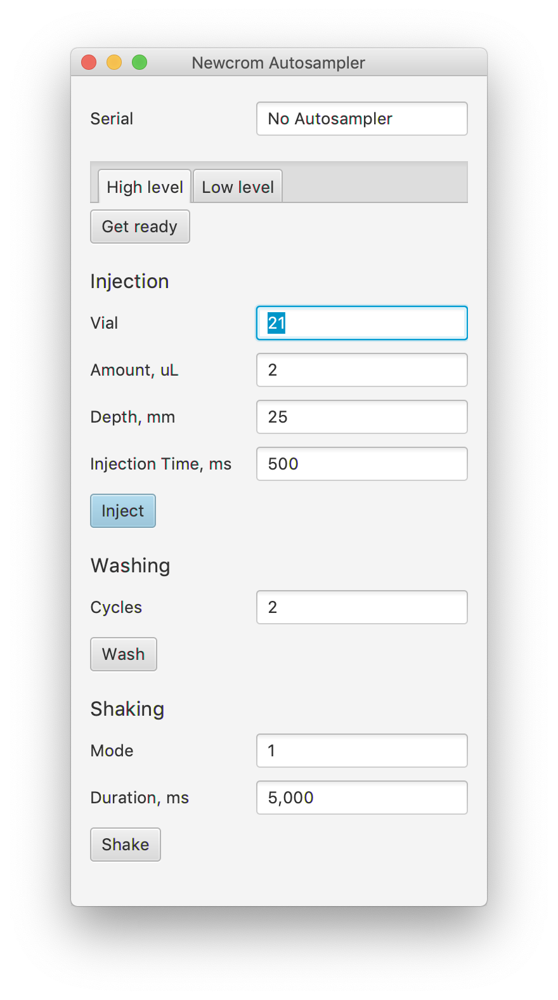
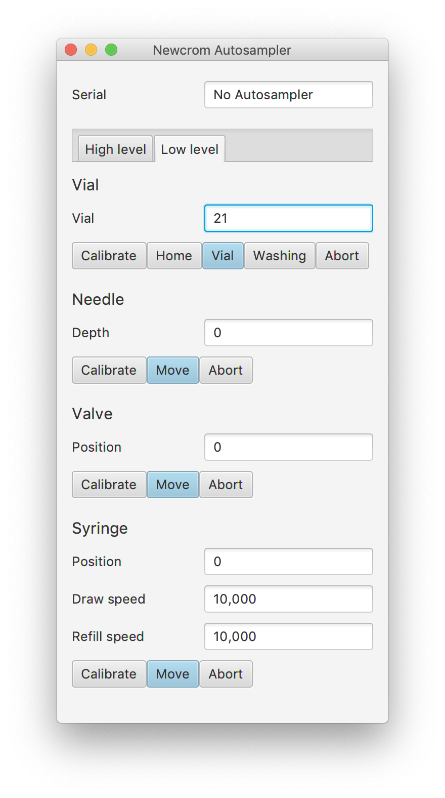

# Newcrom Autosampler Control Demo

Very small and simple autosampler to integrate or use with the cloud. We published a desktop application to demonstrate Autosampler control via USB or Serial Port.
More at https://hplc.cloud/autosampler/.

### High-level commands
- Get ready (Abort)
- Inject
- Wash
- Shake

### Low-level commands
- Home, Choose Vial, Washing
- Needle
- Valve
- Syringe

